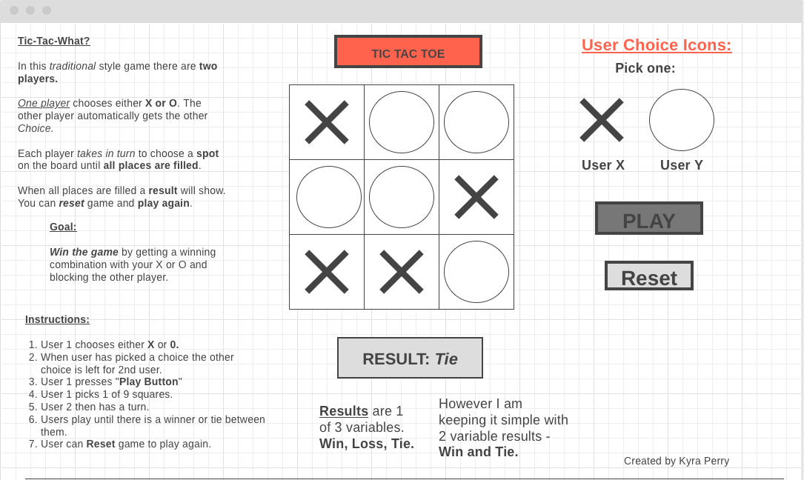
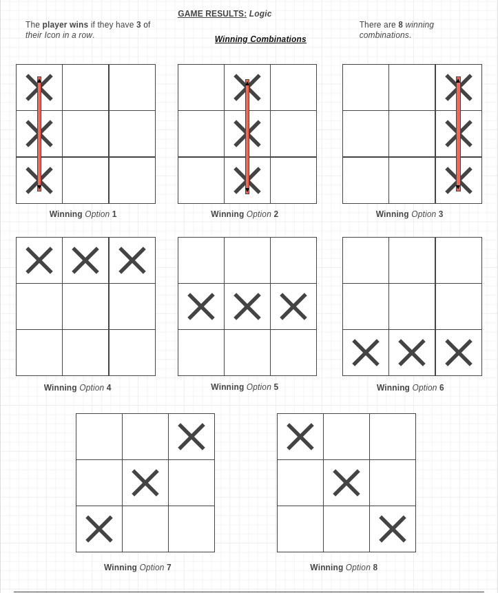
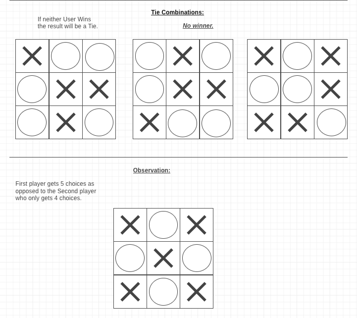

# Project 1 - Tic-Tac-Toe Game

URL for project: https://ky-ra1.github.io/tic-tac-toe/

# Task
Create a game of Tic-Tac-Toe with HTML, CSS and Javascript.

# Technologies Used
For this project I used:
- HTML
- CSS 
- Javascript
- Github 
- Gitpages
- VSCode
- Wireframe.cc 

# Wireframe Drawings and Logic
URL: https://wireframe.cc/CU8Pbg

Game Design and Logic:

# Unsolved Problems
Next update I will try to implement a 'reset scoreboard', ,'play' button and 'user choices'.

Will also add an instructions section to the page.